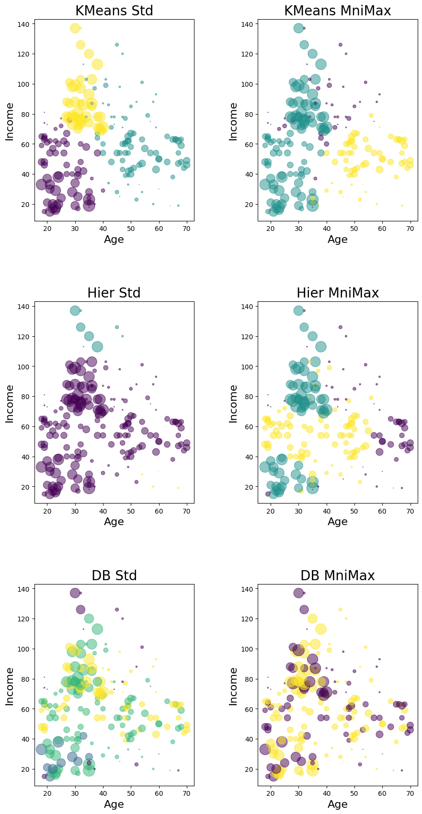

## Clustering of company employees
Machine learning - Clustering  
using :
- Hierarchical 
- K-Means
- DBSCAN

I used the three methods mentioned above to put a data set that was about the employees of a company into different groups (unsupervised).
I also used two different normalization methods. to show the effect of data normalization.

You can see the final result of the project in the image below.

